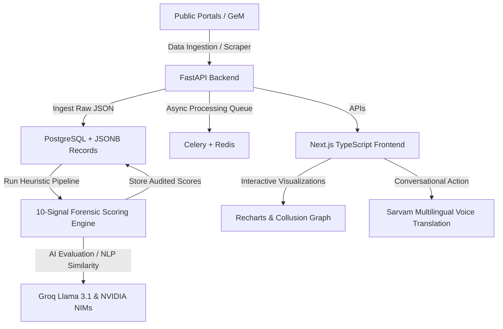

# DARPAN (दर्पण) — Public Procurement Integrity & Citizen Empowerment Platform

> **दर्पण (Darpan - "The Digital Mirror")** is an advanced, real-time, AI-powered anti-corruption platform designed to detect fraud, collusion, and cartels in public procurement, map complex contractor networks, and instantly empower citizens to file legally-binding Right to Information (RTI) applications.

---

## 👁️ Overview & The Problem

Public procurement accounts for a massive portion of public spending in India, yet it remains highly vulnerable to bid-rigging, price inflation, specification tailoring, and vendor cartels.

*   ** reactive Auditing**: Traditional vigilance audits are slow and reactive, typically occurring years after funds are dispersed. Less than 1% of municipal and state-level tenders are ever audited.
*   **Systemic Corruption Cartels**: High-level cartels rotate wins, simulate competition with "cover bids," and tailor tender specifications to a specific vendor's proprietary catalog.
*   **The Citizen Information Barrier**: The **Right to Information (RTI) Act** is a potent weapon against corruption, but drafting legally-sound, high-evidence RTI letters requires legal training and complex data-gathering far beyond the reach of average citizens.

**DARPAN** bridges this gap. It acts as a real-time vigilance watchdog that automatically ingests public tenders, scores them for corruption patterns using a **10-Signal Forensic Detection Engine**, visualizes collusion networks, and automates legal action through **multilingual voice-to-text drafting** and **instant statutory RTI preparation**.

---

## 🚀 Key Capabilities

### 🔍 1. The 10-Signal Detection Engine
DARPAN evaluates every ingested tender across ten distinct forensic signals to calculate a unified risk score (0-100) and risk tier (`Critical`, `High`, `Medium`, `Low`):

| Signal ID | Diagnostic Name | Forensic Method / Scoring Heuristic |
| :--- | :--- | :--- |
| **S01** | **Price Inflation** | Calculates the ratio between the awarded bid value and the prevailing market rate extracted via web-scraping. |
| **S02** | **Specification Tailoring** | Uses NLP cosine similarity to check if the tender text is directly copied from a specific vendor's product catalog. |
| **S03** | **Win Concentration** | Performs department-wide historical aggregations to flag if a single contractor wins a monopolistic share (>65%). |
| **S04** | **Single Bidder Anomalies** | Highlights situations where artificial qualification barriers were introduced to force a single-bidder scenario. |
| **S05** | **Bid Window Manipulation** | Flags tenders with suspiciously short application windows (e.g., 24 to 72 hours) designed to keep competitor bidders in the dark. |
| **S06** | **Shell Entity Detection** | Resolves registration dates via **MCA21** to flag newly-incorporated entities winning major projects within days of incorporation. |
| **S07** | **Price Clustering (Cartels)** | Scans competitor bids to detect tight clustering (e.g., within 0.5% of each other), a classic sign of simulated cover bidding. |
| **S08** | **Linked Entity networks** | Traces corporate connections, matching parent/subsidiary associations, shared DINs (directors), and registered addresses. |
| **S09** | **Cloned Spec Copying** | Compares current tender documents with past RFPs using text embedding models to detect recycled and tailored guidelines. |
| **S10** | **Post-Award Amendments** | Monitors contract amendments immediately after signing to detect artificial price hikes or severe scope changes. |

### 🛠️ 2. Citizen-Centric Legal Empowerment
*   **AI-Powered RTI Drafter (NVIDIA NIMs & Groq)**: Automatically translates the structured evidence package of a corrupt tender into a formal, legally structured RTI letter matching the formatting requirements of the Central and State Public Information Officers (CPIOs).
*   **Voice-Enabled Multilingual Drafting (Sarvam AI)**: Allows citizens to speak in Hindi (or English) to describe local infrastructure problems, which are translated and converted into professional, high-fidelity RTI filings.
*   **Statutory Tracking & Appeals**: Monitored tracking board that enforces the statutory 30-day RTI response timeline, alerting citizens when to submit second-level appeals.

### 📊 3. Interactive Vigilance Dashboards
*   **Collusion Network Graph**: Uses dynamic relationship mapping to expose cartels, linking department officials, winning contractors, and cover-bid partners.
*   **March Rush Analytics**: Highlights peak fiscal year-end budget-dumping anomalies, showcasing sudden spikes in tender publishing and awards before March 31st.

---

## 🏗️ Technical Architecture & Stack

DARPAN is built with a decoupled, high-performance architecture:



### Backend Stack (`/backend`)
*   **Framework**: **FastAPI** (Python 3.11+) - High performance, asynchronous endpoints, auto-generated OpenAPI schemas.
*   **Task Queue**: **Celery** + **Redis** - Handles heavy scraper runs, vector similarity scoring, and AI drafting in the background.
*   **Database & ORM**: **PostgreSQL** + **SQLAlchemy (Async)** - Using specialized `pgvector` for specification similarity searches and rich JSONB records for granular evidence package logs.
*   **Integrations**:
    *   *Groq (Llama 3.1 70B)*: For narrative generation and automated legal drafting.
    *   *NVIDIA NIMs*: Accelerated AI models for document analysis.
    *   *Sarvam AI*: Voice synthesis, transcription, and translation (Hindi/English).
    *   *TinyFish*: Web searches for real-time market price matching.
    *   *MCA21 (MCA)*: Corporate registry director network mapping.

### Frontend Stack (`/frontend`)
*   **Framework**: **Next.js 16** (App Router, React 19) - Built for production performance, SEO optimization, and server-side rendering.
*   **Styling**: **Tailwind CSS v4** - Fast utility-first CSS engine.
*   **Components**: **Radix UI** primitives and customized **Shadcn UI** components.
*   **Visualizations**: **Recharts** & interactive custom canvases for relationship mapping.

---

## 📂 Repository Structure

```
Darpan/
├── backend/                       # Python FastAPI Backend
│   ├── api/                       # API Route definitions (dashboard, tenders, rti, contractors...)
│   ├── db/                        # Database sessions, migrations, and seeds
│   │   └── seeds/seeder.py        # High-fidelity forensic audit seed data
│   ├── fraud/                     # Core Detection Engine & Heuristics
│   │   ├── signals/               # Individual Signal modules (S01 - S10)
│   │   ├── orchestrator.py        # Pipeline execution & weighting
│   │   └── evidence.py            # Evidence package assembler
│   ├── integrations/              # External APIs (Groq, MCA21, Sarvam, NVIDIA, TinyFish)
│   ├── models/                    # SQLAlchemy database tables (Tender, Contractor, Official...)
│   ├── rti/                       # RTI legal drafter and state trackers
│   └── tasks/                     # Celery background workers and tasks
├── frontend/                      # Next.js TypeScript Frontend
│   ├── app/                       # Next.js App Router pages (dashboard, network, march-rush, rti...)
│   ├── components/                # Reusable UI parts & custom collusion graph
│   ├── hooks/                     # Custom React hooks
│   └── lib/                       # API clients and utilities
├── artifacts/                     # Legacy modules / Phase 1 Proof-of-Concepts
│   ├── darpan/                    # Vite + React Client
│   └── api-server/                # Express + Node.js Backend with OpenAPI Specification
├── docker-compose.yml             # Local multi-container development environment
├── package.json                   # Root monorepo workspace package (PNPM)
└── pnpm-workspace.yaml            # Monorepo packages mapping
```

---

## 🛠️ Getting Started & Local Installation

### Prerequisites
Make sure you have the following installed on your machine:
*   [Docker Desktop](https://www.docker.com/products/docker-desktop/)
*   [Node.js (v20+)](https://nodejs.org/) & [pnpm](https://pnpm.io/)
*   [Python (v3.11+)](https://www.python.org/)

---

### Method A: Single-Command Docker Setup (Recommended)
The fastest way to spin up the entire stack (PostgreSQL, Redis, Celery, Backend, Frontend) is with Docker Compose:

1.  **Clone the repository**:
    ```bash
    git clone https://github.com/pritpatel2412/Darpan.git
    cd Darpan
    ```
2.  **Configure Environment Variables**:
    Copy the sample env file and add your AI stacks API keys (Groq, Sarvam, etc.):
    ```bash
    cp .env.example .env
    ```
3.  **Start Services**:
    ```bash
    docker-compose up --build
    ```
4.  **Seed the Database**:
    While the containers are running, run the seeder script to populate high-fidelity audit records:
    ```bash
    docker-compose exec backend python db/seeds/seeder.py
    ```
5.  Access the applications:
    *   **Frontend Dashboard**: [http://localhost:3000](http://localhost:3000)
    *   **Backend OpenAPI Interactive Docs**: [http://localhost:8000/docs](http://localhost:8000/docs)

---

### Method B: Manual Local Development Setup

#### 1. Database & Cache
You need active instances of PostgreSQL and Redis running. You can launch just the database and cache services using Docker:
```bash
docker run --name darpan-db -e POSTGRES_USER=darpan_user -e POSTGRES_PASSWORD=darpan_password -e POSTGRES_DB=darpan -p 5432:5432 -d postgres:16
docker run --name darpan-redis -p 6379:6379 -d redis:7
```

#### 2. Backend Setup
1. Navigate into the backend directory and set up a virtual environment:
   ```bash
   cd backend
   python -m venv .venv
   # On Windows:
   .venv\Scripts\activate
   # On macOS/Linux:
   source .venv/bin/activate
   ```
2. Install dependencies:
   ```bash
   pip install -r requirements.txt
   ```
3. Set up local `.env` inside `/backend` or use the root variables.
4. Populate database tables and seed historical investigation files:
   ```bash
   python db/init_db.py
   python db/seeds/seeder.py
   ```
5. Launch the FastAPI server:
   ```bash
   uvicorn main:app --reload --port 8000
   ```
6. (Optional) In a separate terminal, launch the Celery worker queue:
   ```bash
   celery -A tasks.celery_app worker --loglevel=info
   ```

#### 3. Frontend Setup
1. Open a new terminal in the root directory:
   ```bash
   cd frontend
   ```
2. Install packages:
   ```bash
   pnpm install
   ```
3. Start the Next.js development server:
   ```bash
   pnpm run dev
   ```
4. Open [http://localhost:3000](http://localhost:3000) to view the Darpan integrity suite in your browser!

---

## 🗃️ Forensic Auditing Scenarios (Seed Data)
Once seeded, the platform will load three major public interest cases to demo the full pipeline:

1.  **Case A (Delhi Jal Board - STP Augmentation - ₹1,943 Crore)**:
    *   *Corruption Flags*: Win concentration (Euroteck winning 9/11 STP tenders), extreme price inflation (3.8x market pricing), specification tailoring (mandating proprietary components), and cover bidding by a shared-director joint venture.
    *   *RTI status*: Filed, under surveillance monitoring.
2.  **Case B (Rajasthan Police CCTV Installation - ₹42 Lakh)**:
    *   *Corruption Flags*: Short-lived shell entity (vendor incorporated exactly 10 days before award), price clustering (competitor bids within <0.5% margin), and a restricted 72-hour application window.
    *   *RTI status*: Filed.
3.  **Case C (Telangana Hospital Oxygen Plant - ₹25 Crore)**:
    *   *Corruption Flags*: Suspicious inter-state official overlaps with past flagged contracts.
    *   *Status*: Active pre-award bid surveillance.

---

## 📄 License
This project is open-sourced under the [MIT License](LICENSE).
