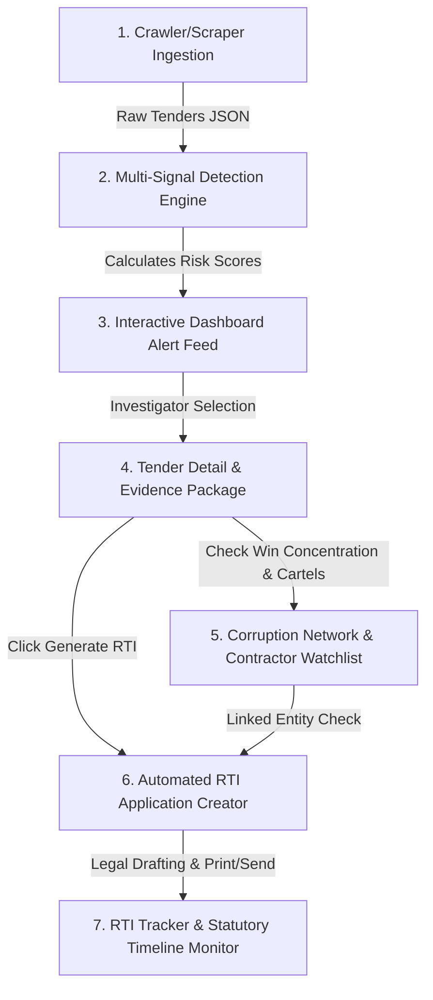

# DARPAN (दर्पण) — Product Journey & User Flow (Phase 1)

This document provides a step-by-step walkthrough of how a user interacts with DARPAN to identify procurement fraud, investigate corrupt contractor networks, and file legally-binding RTI applications.

---

---

## The Step-by-Step Product Journey

### Step 1: Real-Time Crawler & Data Ingestion
*   **Action**: DARPAN's scraping engine scans public procurement portals (like GeM, state e-tender portals, and central directories) for recently published or awarded tenders.
*   **System Event**: The scraper extracts the tender ID, title, department, contract value, dates, bid counts, competitor list, awarded bidder, and technical specifications.
*   **Workspace Touchpoint**: Verified via the **Scraper Sandbox** (`/sandbox`), which showcases live scraping logs, raw payload previews, and pipeline controls.

### Step 2: Multi-Signal Fraud Detection & Scoring
*   **Action**: As soon as a tender is ingested, the core detection pipeline runs a series of 7+ heuristic and NLP calculations:
    *   **Price Inflation (S-01)**: Computes the gap between the awarded price and the prevailing live market rate.
    *   **Specification Tailoring (S-02)**: Uses text NLP cosine similarity to check if the tender requirements are copied directly from a specific contractor's catalog (collusion).
    *   **Contractor Win Concentration (S-03)**: Assesses if a single vendor is winning a disproportionate share (>65%) of tenders in that department.
    *   **Collusion & Clustering (S-07)**: Checks if multiple competitor bids are clustered suspiciously close (e.g., within 0.5%).
*   **System Event**: The system calculates a weighted fraud confidence score from 0-100 and assigns a risk tier: `Critical` (80+), `High` (60-79), `Medium` (40-59), or `Low` (<40).

### Step 3: Interactive Dashboard Alerts & Feed
*   **Action**: Anti-corruption officers, journalists, or citizens open the **Dashboard** (`/`) to see live metrics:
    *   *Total scanned tenders, aggregate detected fraud value, and active RTIs filed.*
    *   A live, real-time fraud alert ticker sorted by risk score.
    *   State heatmaps and department leaderboards identifying high-corruption regions.
*   **Workspace Touchpoint**: The investigator uses the **Tenders Feed** (`/tenders`) to filter by high-risk tiers, departments, or contract values.

### Step 4: In-Depth Investigation (Evidence Packages)
*   **Action**: The investigator clicks on a flagged tender to examine the comprehensive **Evidence Package**.
*   **UI Experience**: The **Tender Detail** page (`/tenders/:id`) displays:
    *   An executive summary outlining the exact reasons the tender is flagged.
    *   Interactive confidence bars for all 7 signals showing the exact mathematical score.
    *   Detailed widgets displaying the price difference (Market price vs. Awarded price) and catalog-matching similarities.

### Step 5: Network Mapping & Cartel Analysis
*   **Action**: The investigator checks the bidder's profile to see if they are a shell company or part of a cartel network.
*   **UI Experience**: Clicking the contractor opens the **Contractor Watchlist** (`/contractors`) and the **Corruption Network Graph** (`/network`):
    *   Exposes CIN details, active registration dates, and linked directors.
    *   Renders an interactive graph showing lines of collusion between the department officials and multiple contractors who bid together in rotation.

### Step 6: Automated RTI Action
*   **Action**: To secure accountability, the investigator clicks **"Generate RTI Application"** directly inside the tender evidence panel.
*   **System Event**: The system compiles the tender title, ID, flags, awarded prices, and specific questions into a legally structured RTI letter matching the formatting requirements of the Central/State Public Information Officers.
*   **Workspace Touchpoint**: Evaluated via the **RTI Detail** page (`/rti/:id`), where the user can view, edit, copy, and print the legal document.

### Step 7: Filing & Tracking
*   **Action**: Once filed, the investigator logs the submission and monitors compliance.
*   **UI Experience**: The **RTI Tracker** (`/rti-tracker`) monitors deadlines, showing days remaining until the statutory 30-day response deadline, highlighting overdue filings for second-level appeals.
